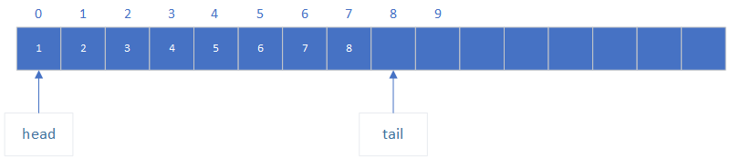
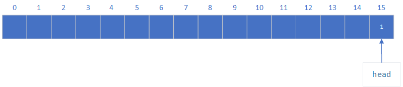
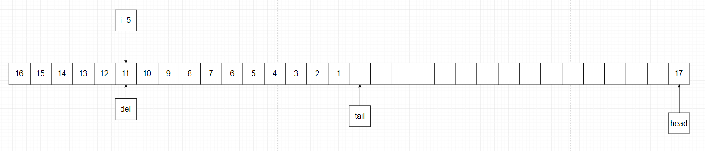
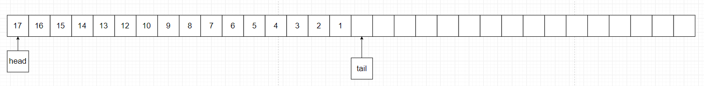

Deque接口的可调整大小的数组实现。数组双端队列没有容量限制；它随着支持使用的必要性来扩展容量。他们不是线程安全的；在没有外部同步的情况下，它不支持被多个线程同时访问。Null元素是被禁止的。==这个类当被用作栈的时候，可能会被Stack类快；并且当被用作队列的时候，要比LinkedList类要快。

大多数的ArrayDeque操作都是以固定时间内运行的。异常包含remove(Object), removeFirstOccurrence, removeLastOccurrence, contains, iterator.remove()和批量操作，所有的这些操作在运行在线性时间内。

这个类的iterator方法返回的迭代器是快速失败的：如果deque在迭代器被创建之后，在任何时候被修改，除了通过迭代器自己的remove方法之后，该迭代器通常会扔出一个ConcurrentModificationException。因此，在面对同时修改的时候，迭代器会快速而干净的失败，而不是在未来不确定的时间不确定行为冒险尝试。

注意，不能保证迭代器的快速故障行为，因为一般来说，在存在非同步并发修改的情况下，不可能做出任何硬保证。失败的快速迭代器会尽最大努力抛出{@code ConcurrentModificationException}。因此，为了它的正确性编写一个依赖于这个异常的程序将会是错误的：迭代器的快速失败行为应该仅仅被用于检测bug。

我们先看一下该类中的一些属性：

	transient Object[] elements; // 非私有以简化嵌套类访问

从这里可以看出，该属性是使用transient修饰的，这说明在该类进行序列化的时候，该属性是不被序列化的。双端队列中的元素被保存到这个数组中。双端队列的容量便是这个数组的长度，该长度一直是2的幂。这个数组是不被允许存满的，除了在addX方法中，一旦被存储满则会立即被重新调整大小，因此这样就避免了头部和尾部互相缠绕。我们也能保证不包含双端队列元素的数组单元总是空的。

因为这里是双端队列，所以在双端队列的实现过程中包含了两个节点，一个头节点head和一个尾部节点tail，这两个节点都是数组的下标索引。

    private static final int MIN_INITIAL_CAPACITY = 8;

这里设置的是新创建的双端队列的最小容量，这个值必须是2的幂次方。

## 1、calculateSize

下面我们看一下双端队列中数组的分配和重新分配大小的工具：

    private static int calculateSize(int numElements) {
	    int initialCapacity = MIN_INITIAL_CAPACITY;
	    // Find the best power of two to hold elements.
	    // Tests "<=" because arrays aren't kept full.
	    if (numElements >= initialCapacity) {
	        initialCapacity = numElements;
	        initialCapacity |= (initialCapacity >>>  1);
	        initialCapacity |= (initialCapacity >>>  2);
	        initialCapacity |= (initialCapacity >>>  4);
	        initialCapacity |= (initialCapacity >>>  8);
	        initialCapacity |= (initialCapacity >>> 16);
	        initialCapacity++;
	
	        if (initialCapacity < 0)   // Too many elements, must back off
	            initialCapacity >>>= 1;// Good luck allocating 2 ^ 30 elements
	    }
	    return initialCapacity;
	}

这里的处理很巧妙，该方法用于计算数组需要的容量的大小，对于给定的参数numElements，如果为12，则因为这里要求的数组长度为2的幂次方，所以numElements期望的值为16。该方法就是为了计算该值。

传入的参数值numElements如果小于初始化最小容量，则不需要做处理。如果超过最小容量，则对该值进行处理，对值做32次无符号右移（这里无符号右移，即如果值为正数，则右移的时候，高位补0；如果为负数，高位也补0）并对原值做或操作。做32次的原因是因为在Java中int类型的值大小为32位，所以操作32次之后，该值12原值对于的2进制为1100，操作完成之后，则值变成了1111，即15；所以对其进行加1操作便完成了期望值的计算。

## 2、allocateElements

该方法用于分配空的给定数量大小的数组。

    private void allocateElements(int numElements) {
    	elements = new Object[calculateSize(numElements)];
	}

这里用到了基础的期望值计算的方法。

## 3、doubleCapacity

该方法用于扩展数组的容量变为两倍。该方法仅仅是在数组满了之后，即当头节点和尾节点首位连接为相等的时候进行调用。

    private void doubleCapacity() {
	    assert head == tail;
	    int p = head;
	    int n = elements.length;
	    int r = n - p; // number of elements to the right of p
	    int newCapacity = n << 1;
	    if (newCapacity < 0)
	        throw new IllegalStateException("Sorry, deque too big");
	    Object[] a = new Object[newCapacity];
	    System.arraycopy(elements, p, a, 0, r);
	    System.arraycopy(elements, 0, a, r, p);
	    elements = a;
	    head = 0;
	    tail = n;
	}

该方法的程序比较简单，首先声明一个两倍长度的数组，然后将原数组的数据复制到新的数组中。

## 4、copyElements

将程序中的数组数据按照顺序（从双端队列中的第一个到最后一个元素）复制到指定的数组中。这里假设数组是足够大的，能够保存双端队列中的所有的元素。

    private <T> T[] copyElements(T[] a) {
	    if (head < tail) {
	        System.arraycopy(elements, head, a, 0, size());
	    } else if (head > tail) {
	        int headPortionLen = elements.length - head;
	        System.arraycopy(elements, head, a, 0, headPortionLen);
	        System.arraycopy(elements, 0, a, headPortionLen, tail);
	    }
	    return a;
	}

该方法主要关注的地方便是当head大于tail的时候，需要分两段进行数组的复制。

## 5、构造方法

该双端队列一共有三个构造方法，如下所示：

    public ArrayDeque() {
	    elements = new Object[16];
	}
	
	public ArrayDeque(int numElements) {
	    allocateElements(numElements);
	}
	
	public ArrayDeque(Collection<? extends E> c) {
	    allocateElements(c.size());
	    addAll(c);
	}

对于无参构造器来说，该双端队列的默认长度为16。当使用给定初始长度的双端队列构造器的时候，则需要使用分配长度方法，将该长度换算成2的幂次方的长度。第三个构造器为给定一个容器作为参数，通过代码可以看出，该构造器内部会先分配数组长度，然后再调用addAll()方法将数据分配给数组。addAll()方法则是AbstractCollection类中封装的方法，其内部调用add方法。

## 6、add方法

该方法用于插入指定元素到该双端队列的尾部。该方法与addLast方法在功能上是相同的。

    public boolean add(E e) {
	    addLast(e);
	    return true;
	}

## 7、addLast方法

该方法用于插入指定元素到该双端队列的尾部。该方法会抛出空指针异常，当被插入的元素为空的时候，则会抛出空指针异常。

    public void addLast(E e) {
	    if (e == null)
	        throw new NullPointerException();
	    elements[tail] = e;
	    if ( (tail = (tail + 1) & (elements.length - 1)) == head)
	        doubleCapacity();
	}

在该双端队列的实现内部，有两个指针head和tail，head指针指向数组中的第一个元素，tail指针指向数组中最后一个元素的下一个位置。所以当插入元素的时候，只需要将tail位置的元素设置为指定元素即可。比较有趣的是后续的操作，即当tail指针转到下一个位置的时候，有可能会超出数组的长度，举个例子：

当刚刚插入元素8的时候，tail将要指向下一个元素，下面我们运行后面代码部分：

    tail + 1 = 8; 其对应二进制为：1000
	elements.length - 1 = 7，该值对应的二进制为：0111

则对其取与操作后，对应的tail = 0；所以由此可以判断需要扩展数组的长度了，则调用doubleCapacity方法扩展数组的长度。

## 8、offerFirst方法

该方法用于在双端队列前面插入一个指定元素。

    public boolean offerFirst(E e) {
            addFirst(e);
            return true;
        }

该方法与方法addFirst的功能是相同的，所以该方法内部调用addFirst方法。

## 9、addFirst方法

该双端队列中主要的插入和提取方法是addFirst, addLast, pollFirst, pollLast。其他方法都是用这些方法实现的。

该方法是在该双端队列的前端插入一个指定元素。当被插入的元素为空的时候，该方法会抛出空指针异常。

    public void addFirst(E e) {
        if (e == null)
            throw new NullPointerException();
        elements[head = (head - 1) & (elements.length - 1)] = e;
        if (head == tail)
            doubleCapacity();
    }

该方法比较有意思，当我们创建完成新的双端队列的时候，默认的值为：

    head = 0;
    elements.length = 16;
    
所以，运行下述逻辑：

    head = (head - 1) & (elements.length - 1)
    head = (-1 & 15)
    head = 15

所以初始添加数据的时候，数据被插入到数组的最后一个位置15，举个例子，我们首次调用addFirst插入元素1。

如图所示：

接着，我们继续调用addFirst方法，插入元素2。

    head = 15
    head = (head - 1) & (elements.length - 1)
    head = (15 - 1) & (16 - 1)
    head = 14 & 15
    head = 14

所以元素2就被插入到14的位置处。    

## 10、offerLast方法

该方法用于在双端队列尾部插入一个指定元素。

    public boolean offerLast(E e) {
        addLast(e);
        return true;
    }

同样，该方法的功能与addLast方法是相同的。

## 11、removeFirst方法

顾名思义，该方法用于移除双端队列中的第一个元素。

    public E removeFirst() {
        E x = pollFirst();
        if (x == null)
            throw new NoSuchElementException();
        return x;
    }

该方法通过调用pollFirst方法弹出第一个元素，同时，如果元素不存在，则抛出元素不存在的异常。

## 12、pollFirst方法

该方法用于弹出head指针指向的元素。

    public E pollFirst() {
        int h = head;
        @SuppressWarnings("unchecked")
        E result = (E) elements[h];
        // Element is null if deque empty
        if (result == null)
            return null;
        elements[h] = null;     // Must null out slot
        head = (h + 1) & (elements.length - 1);
        return result;
    }
    
这里取值的代码部分很简单，直接获取head指针位置的元素，如果元素为空，则返回空。如果元素不为空，则返回该元素，并将数组中head位置的元素置为空，同时运行与addFirst方法相反的方式重新计算head的大小。

最后，返回该元素。

## 13、removeLast方法

该方法用于移除最后一个元素。

    public E removeLast() {
        E x = pollLast();
        if (x == null)
            throw new NoSuchElementException();
        return x;
    }

该方法调用pollLast方法弹出最后一个元素。如果该元素不存在的时候，该方法会抛出元素不存在的异常。

## 14、pollLast方法

该方法用于弹出该双端队列中的最后一个元素。

    public E pollLast() {
        int t = (tail - 1) & (elements.length - 1);
        @SuppressWarnings("unchecked")
        E result = (E) elements[t];
        if (result == null)
            return null;
        elements[t] = null;
        tail = t;
        return result;
    }

由于在该双端队列中，head指针指向的是双端队列中的第一个元素的位置；tail指针指向的是双端队列中的最后一个元素的下一个位置。

所以如果想要获取最后一个元素的位置，则需要获取他的上一个位置，同样调用与addLast方法相反的方式获取最后一个元素的位置。

后续的操作便比较容易理解了。

## 15、元素的获取方法

获取第一个元素，获取最后一个元素等方法，在逻辑上也是比较好理解的。

    /**
     * @throws NoSuchElementException {@inheritDoc}
     */
    public E getFirst() {
        @SuppressWarnings("unchecked")
        E result = (E) elements[head];
        if (result == null)
            throw new NoSuchElementException();
        return result;
    }

    /**
     * @throws NoSuchElementException {@inheritDoc}
     */
    public E getLast() {
        @SuppressWarnings("unchecked")
        E result = (E) elements[(tail - 1) & (elements.length - 1)];
        if (result == null)
            throw new NoSuchElementException();
        return result;
    }

    @SuppressWarnings("unchecked")
    public E peekFirst() {
        // elements[head] is null if deque empty
        return (E) elements[head];
    }

    @SuppressWarnings("unchecked")
    public E peekLast() {
        return (E) elements[(tail - 1) & (elements.length - 1)];
    }
    
这里的getFirst和peekFirst，getLast和peekLast方法唯一的不同，便是对null元素的校验。其中get相关的获取元素的方法是对null元素进行校验的，如果元素为空，则抛出元素不存在的异常；而peek相关的获取元素的方法，则不对元素的null值进行校验，如果元素为空，则直接返回null值。

## 16、removeFirstOccurrence方法

该方法会删除这个双端队列中的指定元素的第一个匹配项（当从头到尾遍历数组的时候）。如果该双端队列不包含该元素，该双端队列不会改变。

更加正式的说法是，如果元素o.equals(e)，并且元素存在的元素，则移除第一个元素。如果这个元素包含指定元素，则返回true。
（或者是等价的，如果这个双端队列因为函数被调用而改变的话）。

    public boolean removeFirstOccurrence(Object o) {
        if (o == null)
            return false;
        int mask = elements.length - 1;
        int i = head;
        Object x;
        while ( (x = elements[i]) != null) {
            if (o.equals(x)) {
                delete(i);
                return true;
            }
            i = (i + 1) & mask;
        }
        return false;
    }

该方法从head开始向tail进行遍历，当遇到第一个不为null并且双端队列中的元素与指定元素相同的时候，则删除该元素。该方法调用delete方法对该元素进行删除。

## 17、delete方法
 
 该方法用于移除元素数组中指定位置的元素，并根据需要调整头部和尾部。这可能会导致数组中的元素向前或向后移动。
 
 此方法称为delete而不是remove，以强调其语义不同于List里面的remove方法。
 
    private boolean delete(int i) {
        checkInvariants();
        final Object[] elements = this.elements;
        final int mask = elements.length - 1;
        final int h = head;
        final int t = tail;
        final int front = (i - h) & mask;
        final int back  = (t - i) & mask;

        // Invariant: head <= i < tail mod circularity
        if (front >= ((t - h) & mask))
            throw new ConcurrentModificationException();

        // Optimize for least element motion
        if (front < back) {
            if (h <= i) {
                System.arraycopy(elements, h, elements, h + 1, front);
            } else { // Wrap around
                System.arraycopy(elements, 0, elements, 1, i);
                elements[0] = elements[mask];
                System.arraycopy(elements, h, elements, h + 1, mask - h);
            }
            elements[h] = null;
            head = (h + 1) & mask;
            return false;
        } else {
            if (i < t) { // Copy the null tail as well
                System.arraycopy(elements, i + 1, elements, i, back);
                tail = t - 1;
            } else { // Wrap around
                System.arraycopy(elements, i + 1, elements, i, mask - i);
                elements[mask] = elements[0];
                System.arraycopy(elements, 1, elements, 0, t);
                tail = (t - 1) & mask;
            }
            return true;
        }
    }
我们举个例子来验证一下该程序的算法实现：

    ArrayDeque<Integer> queue = new ArrayDeque<>();
            
    for(int i = 1;i <= 17;i++){
        queue.addFirst(i);
    }
    
由上述代码得到的双端队列内部的数组形式如下：

从图中可以看出：

    tail = 16
    head = 31
    i = 5  // 要被删除的元素的位置

我们来运行delete程序来看一下该方法的执行过程：

    i = 5;
    elements = {16,15,14,13,12,11,10,9,8,7,6,5,4,3,2,1,
                null,null,null,null,null,null,null,null,null,null,null,null,null,
                null,null,17};
    mask = elements.length - 1 = 31;
    h = head = 31;
    t = tail = 16;
    front = (i - h) & mask = (-26) & 31 = 6
    back  = (t - i) & mask = (16 - 5) & 31 = 11 & 31 =  11
    (t - h) & mask = (-15) & 31 = 17
    
执行完成后，数组的数据结构变为如图所示：

## 18、removeLastOccurrence方法
 
移除该双端队列中最后一个匹配指定元素的元素（这里最后一个匹配元素指的是从头部向尾部遍历的时候，最后一个匹配的元素）。
 
该方法与上述方法的处理过程基本上是一样的，不过该双端队列的遍历是从尾部开始，这样第一个匹配的元素即为逻辑上最后一个匹配的元素。

    public boolean removeLastOccurrence(Object o) {
        if (o == null)
            return false;
        int mask = elements.length - 1;
        int i = (tail - 1) & mask;
        Object x;
        while ( (x = elements[i]) != null) {
            if (o.equals(x)) {
                delete(i);
                return true;
            }
            i = (i - 1) & mask;
        }
        return false;
    }

从此开始，后续的方法便是队列的相关操作方法。我们一起来学习一下。

## 19、add方法

该方法调用addLast方法，用于在该双端队列的尾端插入一个元素，并返回true。当该方法中被插入的元素为空的时候，将会抛出空指针异常。

    public boolean add(E e) {
        addLast(e);
        return true;
    }
    
## 20、offer方法

该方法是调用上述的offerLast方法，功能与add方法一致，同样也是用于将元素插入该双端队列的尾部。当被插入的元素为空的时候，该方法也会抛出空指针异常。

    public boolean offer(E e) {
        return offerLast(e);
    }
    

## 21、remove方法

该方法调用上述的removeFirst方法，用于移除该双端队列中的头部的第一个元素。

    public E remove() {
        return removeFirst();
    }
    
## 22、poll方法

该方法调用pollFirst方法用于获取并移除该双端队列中的头部元素。

    public E poll() {
        return pollFirst();
    }
    
## 23、element方法

该方法用于获取该双端队列中的头部元素，但是并不移除该元素，但是当被获取的元素不存在的话，则抛出元素不存在的异常。

    public E element() {
        return getFirst();
    }
    
## 24、peek方法

该方法用于获取该双端队列中的头部元素，但并不是移除；同时如果元素不存在，则返回空元素。

    public E peek() {
        return peekFirst();
    }

至此，相关队列queue的操作方法基本上完成了。从此之后的后续操作，是相关于栈(Stack)的操作。

## 25、push操作

该方法用于向栈中压入一个元素，相对于在该双端队列中来说，相当于向该双端队列中的首部插入一个元素。

    public void push(E e) {
        addFirst(e);
    }
    
## 26、pop方法

该方法是栈操作中弹出头部元素，相当于在双端队列中移除头部元素。

    public E pop() {
        return removeFirst();
    }

这样，栈的元素的压入操作和弹出操作就完成了。接着我们学习一个集合相关的操作方法。

后续的获取双端队列的长度，移除元素等方法都比较简单了。后面有一个比较有意思的便是其内部类实现了Spliterator接口，该接口是java 8中新增的用于并行计算的接口，后续我们将专门对该接口进行学习。